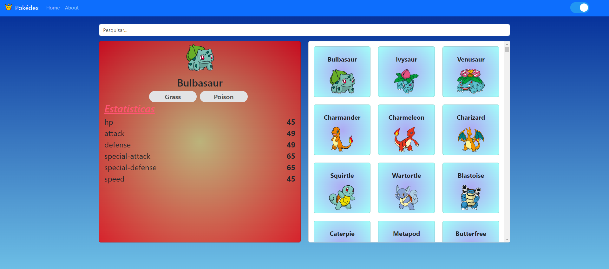

## Projeto 
Pokemon 
### Objetivo

Esee projeto é o desenvolvimento de uma interface dos pokemons  que lista todos os Pokémon utilizando a api do Pokédex 

## Site do Projeto 
https://pok-dex-vue3.vercel.app/

## Imagem do Projeto
<!--  -->

## Repositorio do Projeto para clonar
git clone git  git remote add origin https://github.com/JacquelineCasali/Pok-dex-vue3

Seleciona o botão code vai na opção Download ZIP

## Rodar o Projeto no FrontEnd 

-  cd frontEnd
-  npm install
-  npm run dev

## 🛠 Tecnologias utilizadas

- **[Vue3]**
- **[Vite]**

## 📝 Licença

Projeto desenvolvido por Jacqueline Casali.
